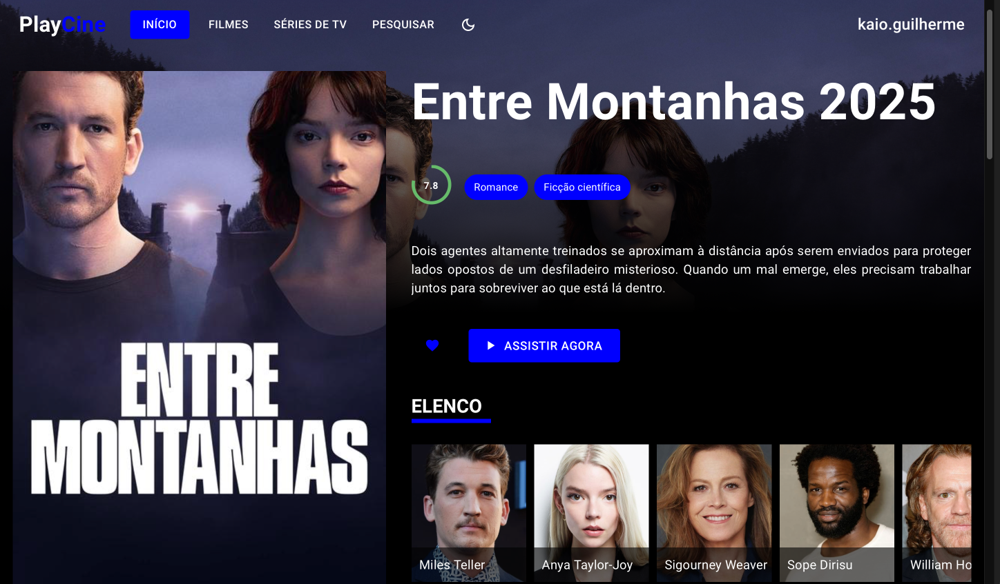

# PlayCine

## Introdução

Este repositório contém o código-fonte do PlayCine, uma aplicação para assistir filmes e séries. O projeto é dividido em duas partes principais: o backend e o frontend.

## Estrutura do Repositório

- `backend`: Contém o código-fonte do backend da aplicação.
- `frontend`: Contém o código-fonte do frontend da aplicação.

## Documentação

Para mais detalhes sobre como configurar e executar cada parte do projeto, consulte os respectivos arquivos README:

- [Backend README](./backend/README.md)
- [Frontend README](./frontend/README.md)

## Deploy

Para fazer o deploy da aplicação completa, siga os passos descritos nos arquivos README do backend e do frontend. Certifique-se de configurar corretamente as variáveis de ambiente e de iniciar os serviços necessários.

---

Este `README.md` fornece uma visão geral básica da estrutura do repositório e aponta para a documentação específica de cada parte do projeto.